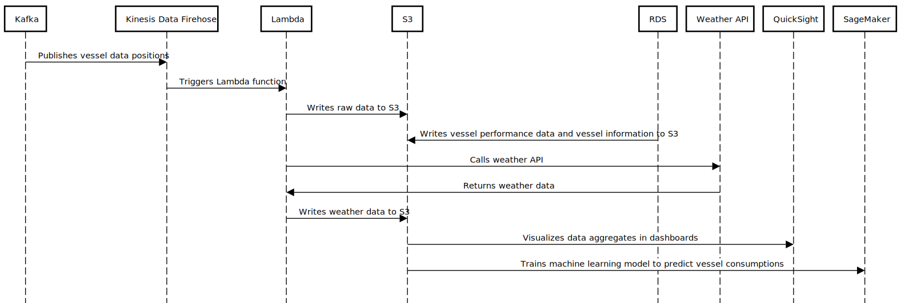
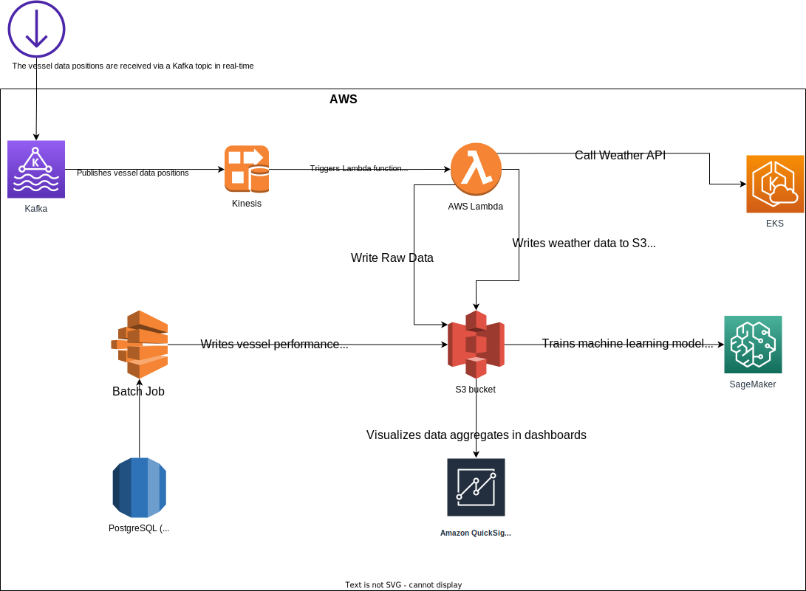

# Data Pipeline in AWS

This is a data pipeline in AWS that prepares data for several operations, including creating an AI model to predict vessel consumptions and visualizing data aggregates in analytics dashboards.

## Input Data

* Vessel data positions: latitude, longitude, speed over ground, heading. Frequency: every 15 minutes. Data source: Kafka.
* Vessel performance data: engine power, current direction, fuel and oil temperature (total 300 metrics). Frequency: every day, sampled every hour. Data source: PostgreSQL.
* Vessel information: name, identification, fleet, type, length, breath. Frequency: slow-changing data, once a week. Data source: PostgreSQL.
* Weather data for the vessel positions. Data source: web API.

 

## Architecture

The data pipeline has the following components:
 

1. Kafka: The vessel data positions are received via a Kafka topic in real-time.
2. Amazon Kinesis Data Firehose: Ingests data from the Kafka topic and stores it in Amazon S3 as raw data. The data is also transformed using Amazon Lambda, which can be used to perform any pre-processing required.
3. Amazon S3: Raw data is stored in Amazon S3 for data archiving and backup purposes. The S3 bucket is also used as the data source for Amazon Athena for ad-hoc querying.
4. Amazon RDS (PostgreSQL): Vessel performance data and vessel information are stored in a PostgreSQL database hosted on Amazon RDS. The database is updated on a daily basis with the latest information.
5. Amazon Lambda: Fetches weather data from a web API and stores it in Amazon S3 as raw data.
6. Amazon QuickSight: The data stored in Amazon S3 and Amazon RDS is used to create interactive dashboards that visualise aggregates such as count, mean, and ninety percentiles.
7. Amazon SageMaker: The data stored in Amazon S3 is used to train a machine learning model that predicts vessel consumption.

 

## Sequence of Operations

The following is the sequence of operations in the data pipeline:

1. Kafka publishes the vessel data positions.
2. Amazon Kinesis Data Firehose ingests the data from the Kafka topic and triggers an Amazon Lambda function.
3. Amazon Lambda performs any pre-processing required and writes the raw data to Amazon S3.
4. Amazon RDS writes the vessel performance data and vessel information to Amazon S3.
5. Amazon Lambda fetches weather data from a web API and writes it to Amazon S3.
6. Amazon QuickSight visualizes the data aggregates in dashboards.
7. Amazon SageMaker trains a machine learning model to predict vessel consumptions using the data stored in Amazon S3.

 

## Sequence Diagram

 

## Architecture
